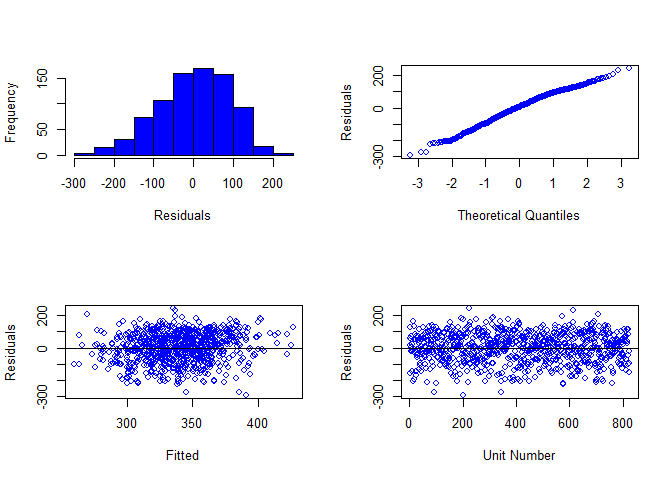
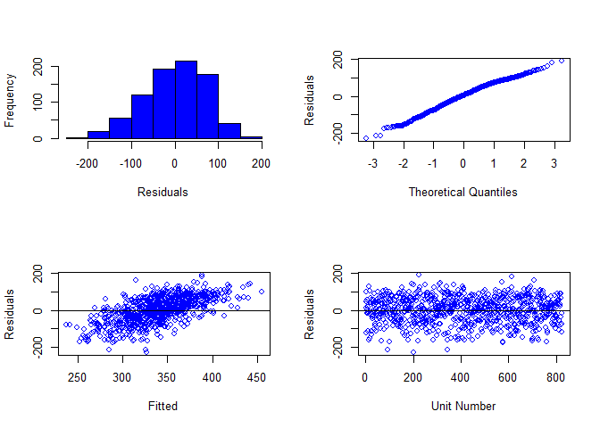

BreedRPlus manual
================

## About breedRPlus

The breedRPlus is builded on the base of package `'breedR'` for some
additional functions, such as calculating standard error (se), running
batch analysis, etc. At present, breedRPlus only works for `'ai'` method
in `'breedR'`, not well worked for spatial (and competition) model at
present.

## Install package

``` r
install.packages(c('devtools','dplyr','nadiv','ggplot2','plyr','msm','reshape2'))

devtools::install_github(c('yzhlinscau/bdRPlus'))
```

## breedRPlus function

  - var() to get variance components, similar to asreml;
  - plot1() to test trait’s norm, similar to asreml;
  - pin() to calculate heritability or corr with se;
  - batch1() to run batch analysis for single trait.

## 00 Example data

Using data `'douglas'` from package `'breedR'`:

``` r
data(douglas)

S3 <- subset(douglas, site == 's3' )
S3a <- filter(S3, is.na(dad)) 
S3a <- transform(S3a, Mum = factor(mum))
S3a <- droplevels(S3a)
```

## 01 single trait analysis

### 01A family model

``` r
m1 <- remlf90(fixed = H04 ~ 1 + orig,
              random = ~ Mum + block,
              data = S3a)
```

#### analysis results

test trait’s norm

``` r
plot1(m1)
```



get variance components:

``` r
var(m1)
##               gamma component std.error   z.ratio constraint
## Mum      0.07329389    624.31    303.18  2.059206   Positive  # V1
## block    0.05959450    507.62    214.96  2.361463   Positive  # V2
## Residual 1.00000000   8517.90    436.16 19.529301   Positive  # V3
```

calculate heritability:

``` r
pin(m1, h2 ~ 4 * V1/(V1 + V3))
## 
##    Estimate      SE
## h2  0.27315 0.12501
```

### 01B tree(animal) model

``` r
im1 <- remlf90(fixed = H04 ~ 1 + orig,
               random  = ~ block,
               genetic = list(model = 'add_animal', 
                              pedigree = S3a[,1:3],
                             id = 'self'),
               data=S3a)
```

#### analysis results

test trait’s
norm:

``` r
plot1(im1)
```



get variance components:

``` r
var(im1)
##               gamma component std.error  z.ratio constraint
## block    0.07639127    507.62    214.96 2.361463   Positive  # V1
## genetic  0.37580135   2497.20   1212.70 2.059207   Positive  # V2
## Residual 1.00000000   6645.00   1030.90 6.445824   Positive  # V3
```

calculate heritability:

``` r
pin(im1, h2 ~ V2/(V2 + V3))
## 
##    Estimate      SE
## h2  0.27315 0.12501
```

## 02 singe trait--batch analysis

data reshape

``` r
names(S3a)[7:8] <- c('x1','y1')
df <- tidyr::gather(S3a, key = Trait, y, c(-1:-8,-12,-14:-16))
```

### 02A family model

``` r
# for family model
fixed <- y ~ 1 + orig
random1 <- ~ Mum + block
pformula1 <- h2 ~ 4 * V1/(V1 + V3)

mm1 <- plyr::ddply(df,'Trait',
          function(dat) batch1(dat,FMod = fixed,
                                   RMod = random1,
                                  pformula = pformula1)
          )
```

batch analysis result:

``` r
mm1
##   Trait       AIC    logLik     Mum  block Residual Mum.se block.se
## 1   C13 10095.399 -5044.700 2218.20 537.08  21156.0 979.67  356.640
## 2   H02  9056.080 -4525.040  203.66 211.55   3818.3 112.64   94.259
## 3   H03  9399.865 -4696.933  387.74 303.46   5831.9 195.49  137.680
## 4   H04  9790.566 -4892.283  624.31 507.62   8517.9 303.18  214.960
##   Residual.se    h2 h2.se
## 1     1111.00 0.380 0.154
## 2      196.70 0.203 0.108
## 3      300.24 0.249 0.119
## 4      436.16 0.273 0.125
```

### 02B tree(animal) model

``` r
# for tree model
fixed <- y ~ 1 + orig
random2 <- ~ block
genetic <- list(model = 'add_animal', 
                pedigree = S3a[,1:3],
                id = 'self')
pformula2 <- h2 ~ V2/(V2 + V3)

mm2 <- plyr::ddply(df,'Trait',
          function(dat) batch1(dat,FMod = fixed,
                                   RMod = random2,
                                   geneticM = genetic,
                                   pformula = pformula2)
          )
```

batch analysis result:

``` r
mm2
##   Trait       AIC    logLik  block genetic Residual block.se genetic.se
## 1   C13 10095.399 -5044.700 537.08 8872.90  14501.0  356.640    3918.70
## 2   H02  9056.080 -4525.040 211.55  814.64   3207.3   94.259     450.54
## 3   H03  9399.865 -4696.933 303.46 1551.00   4668.7  137.680     781.97
## 4   H04  9790.566 -4892.283 507.62 2497.20   6645.0  214.960    1212.70
##   Residual.se    h2 h2.se
## 1     3192.20 0.380 0.154
## 2      402.83 0.203 0.108
## 3      674.84 0.249 0.119
## 4     1030.90 0.273 0.125
```

## 03 multi-trait model

### 03A family model

``` r
mt1 <- remlf90(fixed  = cbind(H04, C13) ~ orig,
               random = ~ Mum + block,
               data = S3a)
```

get variance components:

``` r
var(mt1, mulT = TRUE)
##                              gamma component std.error   z.ratio
## Mum.H04                     620.71    620.71    301.90  2.056012
## Mum.H04_Mum.C13             962.38    962.38    503.90  1.909863
## Mum.C13                    2208.60   2208.60    987.11  2.237441
## block.H04                   531.88    531.88    221.03  2.406370
## block.H04_block.C13         362.63    362.63    270.11  1.342527
## block.C13                   879.39    879.39    452.53  1.943274
## Residual.H04               8510.30   8510.30    435.58 19.537858
## Residual.H04_Residual.C13 12256.00  12256.00    676.82 18.108212
## Residual.C13              22894.00  22894.00   1194.90 19.159762
##                           constraint
## Mum.H04                     Positive
## Mum.H04_Mum.C13             Positive
## Mum.C13                     Positive
## block.H04                   Positive
## block.H04_block.C13         Positive
## block.C13                   Positive
## Residual.H04                Positive
## Residual.H04_Residual.C13   Positive
## Residual.C13                Positive
```

calculate heritability for both traits:

``` r

pin(mt1, h2.H04~ 4 * V1/(V1 + V7))
## 
##        Estimate      SE
## h2.H04  0.27191 0.12468
pin(mt1, h2.C13~ 4 * V3/(V3 + V9))
## 
##        Estimate      SE
## h2.C13  0.35193 0.14523
```

calculate genetic, residula, and phenotypic correlations:

``` r
pin(mt1, gcorr ~ V2/sqrt(V1 * V3), signif=TRUE)
## 
##       Estimate      SE sig.level
## gcorr  0.82195 0.10289       ***
## ---------------
## Sig.level: 0'***' 0.001 '**' 0.01 '*' 0.05 'Not signif' 1
pin(mt1, ecorr ~ V8/sqrt(V7 * V9), signif=TRUE)
## 
##       Estimate      SE sig.level
## ecorr  0.87804 0.00848       ***
## ---------------
## Sig.level: 0'***' 0.001 '**' 0.01 '*' 0.05 'Not signif' 1
pin(mt1, pcorr ~ (V2+V8)/sqrt((V1+V7)*(V3+V9)), signif=TRUE)
## 
##       Estimate      SE sig.level
## pcorr  0.87309 0.01033       ***
## ---------------
## Sig.level: 0'***' 0.001 '**' 0.01 '*' 0.05 'Not signif' 1
```

### 03B tree(animal) model

``` r
mt2 <- remlf90(fixed  = cbind(H04, C13) ~ orig,
               random = ~ block,
               genetic = list(model = 'add_animal', 
                           pedigree = S3a[,1:3],
                           id = 'self'),
               data = S3a)
```

get variance components:

``` r
var(mt2, mulT = TRUE )
##                                          gamma component std.error
## block.H04                             183970.0  183970.0    4592.1
## block.H04_block.C13                   393310.0  393310.0    4916.5
## block.C13                             842610.0  842610.0       0.0
## genetic.direct.H04                      2435.6    2435.6    1195.5
## genetic.direct.H04_genetic.direct.C13   3698.6    3698.6    1974.4
## genetic.direct.C13                      8415.0    8415.0    3835.2
## Residual.H04                            6695.7    6695.7    1020.3
## Residual.H04_Residual.C13               9535.2    9535.2    1664.5
## Residual.C13                           16714.0   16714.0    3177.0
##                                         z.ratio constraint
## block.H04                             40.062281   Positive
## block.H04_block.C13                   79.997966   Positive
## block.C13                                   Inf   Positive
## genetic.direct.H04                     2.037307   Positive
## genetic.direct.H04_genetic.direct.C13  1.873278   Positive
## genetic.direct.C13                     2.194149   Positive
## Residual.H04                           6.562482   Positive
## Residual.H04_Residual.C13              5.728567   Positive
## Residual.C13                           5.260938   Positive
```

calculate heritability for both traits:

``` r

pin(mt2, h2.H04 ~ V4/(V4 + V7))
## 
##        Estimate      SE
## h2.H04  0.26673 0.12361
pin(mt2, h2.C13 ~ V6/(V6 + V9))
## 
##        Estimate      SE
## h2.C13  0.33487 0.14161
```

calculate genetic, residula, and phenotypic correlations:

``` r
pin(mt2, gcorr ~ V5/sqrt(V4 * V6), signif=TRUE)
## 
##       Estimate      SE sig.level
## gcorr  0.81697 0.10635       ***
## ---------------
## Sig.level: 0'***' 0.001 '**' 0.01 '*' 0.05 'Not signif' 1
pin(mt2, ecorr ~ V8/sqrt(V7 * V9), signif=TRUE)
## 
##       Estimate      SE sig.level
## ecorr  0.90135 0.03005       ***
## ---------------
## Sig.level: 0'***' 0.001 '**' 0.01 '*' 0.05 'Not signif' 1
pin(mt2, pcorr ~ (V5+V8)/sqrt((V4+V7)*(V6+V9)), signif=TRUE)
## 
##       Estimate      SE sig.level
## pcorr  0.87364 0.01025       ***
## ---------------
## Sig.level: 0'***' 0.001 '**' 0.01 '*' 0.05 'Not signif' 1
```

#### More details will be updated in the futures.
